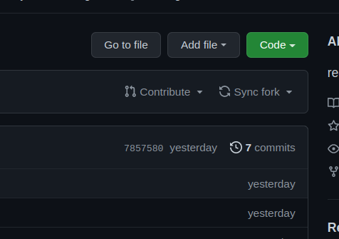

# Python Session Assignment submission

- **Fork this repository**
    
    > Forking means creating a copy of this repository to your profile
    > 
- **Add a folder with your name inside the folder of the corresponding day**
    
    > eg    Day1/sunith_vs
    > 
- **create the files with the extension .py**
    
    > please make new file for each question
    > 
- **Enter your code and execute it.**
- **Take the output screenshots**
- **commit and push to the repository.**
    
    ```python
    git add .
    git commit -m "describe about what you have done so far"
    git push
    ```
    
- **Create a pull request by clicking the contribute button**
    
    
    
- **Complete the pull request by entering the details.**
    
     ****
    
    
    
    
    

## Keep practicing more questions

